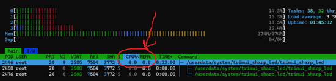

This is my take on yet another LED controller for Trimui Smart Pro, focused on performance.

I got tired of seeing the other alternatives out there taking around ~5% of a CPU core, which I consider unacceptable just to switch up some dumb lights. Even more so they are all written in C.
This one takes around 0.6% of a CPU core (0% most of the time, depending on the effect you choose).
And I know it can be optimized further...

On the other hand, since I wrote this for myself, it has a few limitations:

* Tested only on TSP: It could work on Trimui Brick but since there are some hardware differences, you should expect some LEDs to not light up.
* Knulli release only: It can and will work on any OS, but the released service *.sh script is specific to Knulli. But you can easily adapt it.

Installation on knulli
=======

1. Download a [release](https://github.com/andriniaina/trimui_sharp_led/releases/latest)
2. Unzip and copy to `/userdata/system/`. You should have folders named /userdata/system/services and /userdata/system/trimui_sharp_led
3. Modify `trimui_sharp_led.ini`
4. Go to `System Settings > Services`, disable all other LED services, enable the service TRIMUI_SHARP_LED

Configuration
=======

## Supported effect names:

Left and Right sticks:
 * rainbow: spinning color wheel
 * battery: show remaining battery percentage in a circle
 * nexus: spins randomly 3 LEDs
 * wipe: fills the circle back and forth

Middle:
 * rainbow
 * battery
